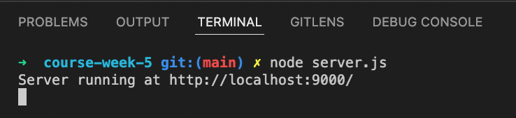
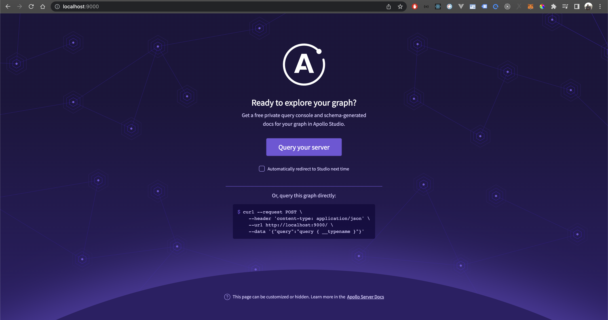

# Summary of GraphQL by Example
  

- By: Mirko Nasato
- Source: https://www.udemy.com/course/graphql-by-example/learn/lecture/10137622#overview
- Language: NodeJS
- Library: apollo-server
  
## What is GraphQL
GraphQL is a query language for APIs and a runtime for fulfilling those queries with your existing data. GraphQL provides a complete and understandable description of the data in your API, gives clients the power to ask for exactly what they need and nothing more, makes it easier to evolve APIs over time, and enables powerful developer tools.

## Why GraphQL
- Ask for what you need, get exactly that
- Get many resources in a single request
- Describe what’s possible with a type system
- Move faster with powerful developer tools
- Evolve your API without versions
- Bring your own data and code

## Setup GraphQL with Apollo-server
you can access this docs in: https://www.apollographql.com/docs/apollo-server

- <a href="https://www.apollographql.com/docs/apollo-server/schema/schema">GraphQL schema basics</a>
- <a href="https://www.apollographql.com/docs/apollo-server/data/resolvers">Resolvers</a>

Example code GraphQL with apollo-server
```
const { ApolloServer, gql } = require('apollo-server');

const typeDefs = gql`
    type Query {
        greeting: String 
    }
`;

const resolvers = {
    Query: {
        greeting: () => 'Hello GraphQL world'
    }
}

const server = new ApolloServer({
    typeDefs, resolvers
})
server.listen({
    port: 9000
}).then(({url}) => console.log(`Server running at ${url}`))
```
Run: `node server.js`


GraphQL server running `http://localhost:9000`



## Operation request format
GraphQL accepts queries and mutations sent as POST requests. It also accepts queries sent as GET requests.

### POST requests
GraphQL accepts POST requests with a JSON body. A valid request contains a query field, along with optional variables and an operationName (if query contains multiple possible operations).

Let's say we want to execute the following query:
```
query GetBestSellers($category:ProductCategory) {
  bestSellers(category: $category) {
    title
  }
}
```
Here's an example of a valid POST request body for that query:
```
{
  "query":"query GetBestSellers($category:ProductCategory){bestSellers(category: $category){title}}",
  "operationName": "GetBestSellers",
  "variables": { "category": "BOOKS" }
}
```

### GET requests
GraphQL also accepts GET requests for queries (but not mutations). With a GET request, query details (query, operationName, variables) are provided as URL query parameters. The variables option is a URL-escaped JSON object.

Sending queries as GET requests can help with CDN caching.

Here's the same query from POST requests formatted for a curl GET request:
```
curl --request GET \
  https://rover.apollo.dev/quickstart/products/graphql?query=query%20GetBestSellers%28%24category%3AProductCategory%29%7BbestSellers%28category%3A%20%24category%29%7Btitle%7D%7D&operationName=GetBestSellers&variables=%7B%22category%22%3A%22BOOKS%22%7D
```


## GraphQL Queries
### What is a GraphQL Query? 
In GraphQL, you fetch data with the help of queries. A query is a GraphQL Operation that allows you to retrieve specific data from the server.

Let’s look at the following GraphQL query:
```
{
  todos {
    title
  }
}
```
### GraphQL Query Example
Executing the above query would return the following response:
```
{
  "data": {
    "todos": [
      {
        "title": "Learn GraphQL"
      },
      {
        “title": “Learn about queries"
      }
    ]
  }
}
```

## GraphQL Mutations (Writing data)
### What is a GraphQL Mutation?

Up to this point, you only learned how to fetch data in GraphQL. But the real-world applications are complex and you also need to insert, update or delete data. The question is - how do you do it?

In GraphQL, you insert, update or delete data with mutations. A Mutation is a GraphQL Operation that allows you to insert new data or modify the existing data on the server-side. You can think of GraphQL Mutations as the equivalent of POST, PUT, PATCH and DELETE requests in REST.

To understand better, let’s look at a GraphQL Mutation example:
```
mutation {
  insert_todos(objects: [{ title: "Learn GraphQL" }]) {
    returning {
      id
      created_at
    }
  }
}
```
### Types of GraphQL Mutations
Mutations in GraphQL can be categorised under the following types:
- Insert Mutations
- Update Mutations
- Delete Mutations
